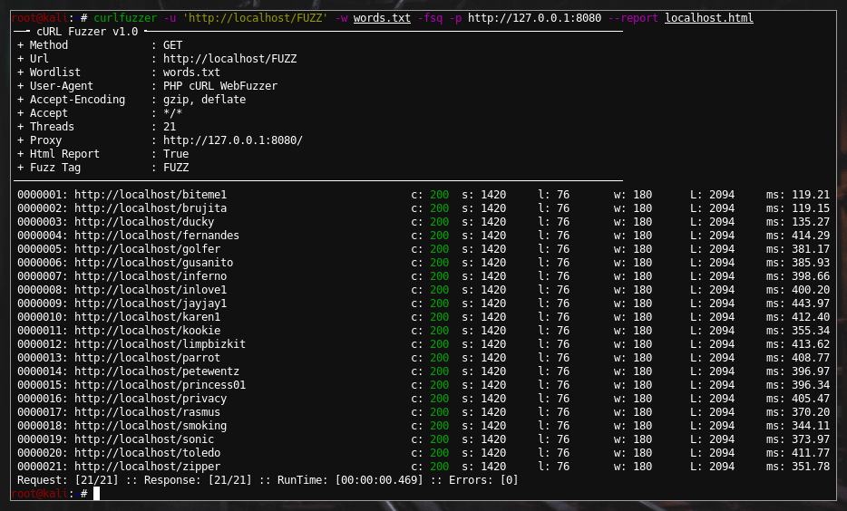

## curlfuzzer
curlfuzzer is a simple web fuzzer in php with curl library.

</img>

### Install
You will need to install php and php-curl library first
```
git clone https://github.com/kali69bazdmeg/curlfuzzer.git
cp curlfuzzer/curlfuzzer /usr/local/bin/curlfuzzer
chmod +x /usr/local/bin/curlfuzzer
```
### Usage
```
curlfuzzer by Anonymous Kali
Usage: curlfuzzer [OPTIONS]

  -u,   --url          string  : set target url
  -d,   --data         string  : POST data (format: foo=bar or {"foo":"bar"})
  -t,   --thread       integer : multi thread
        --timeout      integer : set timeout
  -X,   --method       string  : set request method
  -b,   --cookie       string  : set cookie
  -p,   --proxy        string  : set proxy (format: type://host:port/ or type://user@pass:host:port/)
                                             types: http, https, socks4a, socks<4-5>
  -H,   --header       string  : set request header
  -A,   --user-agent   string  : set costume user-agent or emulate android, ios, firefox header
  -i,   --interface    string  : set interface (You can not use it with a proxy)
        --cacert       string  : set cacert PEM, CER
        --insecure     null    : disables TLS certificate validation
        --http1.0      null    : use HTTP 1.0
        --http1.1      null    : use HTTP 1.1
        --http2        null    : use HTTP 2
        --http2pk      null    : use HTTP 2 without HTTP/1.1 Upgrade
  -q,   --uniq         null    : unique wordlist content
  -s,   --sort         null    : sort wordlist content
  -f,   --full         null    : full payload write

        --right        null    : Payload in right
  -r,   --reflect      null    : Reflect to payload
        --report       null    : make report
        --req-report   string  : report all request in file
        --res-report   null    : report all response
        --sleep        integer : x request / sec
        --test         null    : send 3 request
        --verbose      null    : verbose log

        --lower        null    : payload string lower
        --upper        null    : payload string upper
        --b64e         null    : payload string base64 encode
        --b64d         null    : payload string base64 decode
        --urlen        null    : payload string url encode
        --urlde        null    : payload string url decode
        --hex          null    : payload string to hexadecimal

  --sc, --hc           integer : Show/Hide response status code
  --sl, --hl           integer : Show/Hide response lines
  --sw, --hw           integer : Show/Hide response words
  --sL, --sL           integer : Show/Hide response length
  --ss, --hs           integer : Show/Hide response size
  --sf, --hf           string  : Show/Hide response str
  --st, --sb           float   : Smaller/Bigger time

Fuzzezable items: [url, header, user_agent, method, post_data, cookie]
Fuzz tag: FUZZ

ex:
 - curlfuzzer -u 'http://example.com/FUZZ' -w words.txt --method PUT --tread 20 --hc 404
 - curlfuzzer -u 'http://example.com/FUZZ' -w words.txt --hc 404 --tread 200 --user-agent android
 - curlfuzzer -u 'http://example.com/userinfo.php' --data 'uname=test&pass=FUZZ' -w words.txt --hf 'you must login'
 - curlfuzzer --url 'http://example.com/FUZZ' --test --hc 404 --hc 403 --full --uniq -p http://127.0.0.1:8080/
 - curlfuzzer --url 'http://example.com/' --wordlist words.txt --sc 200,204,301,302,307,401,403,405
```
## License
Shield: [![CC BY-NC-SA 4.0][cc-by-nc-sa-shield]][cc-by-nc-sa]

This work is licensed under a
[Creative Commons Attribution-NonCommercial-ShareAlike 4.0 International License][cc-by-nc-sa].

[![CC BY-NC-SA 4.0][cc-by-nc-sa-image]][cc-by-nc-sa]

[cc-by-nc-sa]: http://creativecommons.org/licenses/by-nc-sa/4.0/
[cc-by-nc-sa-image]: https://licensebuttons.net/l/by-nc-sa/4.0/88x31.png
[cc-by-nc-sa-shield]: https://img.shields.io/badge/License-CC%20BY--NC--SA%204.0-lightgrey.svg
